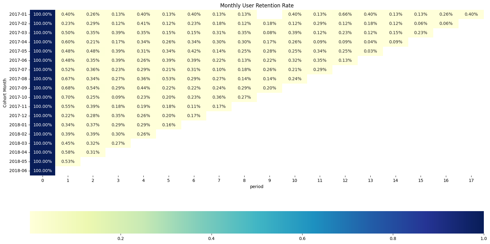
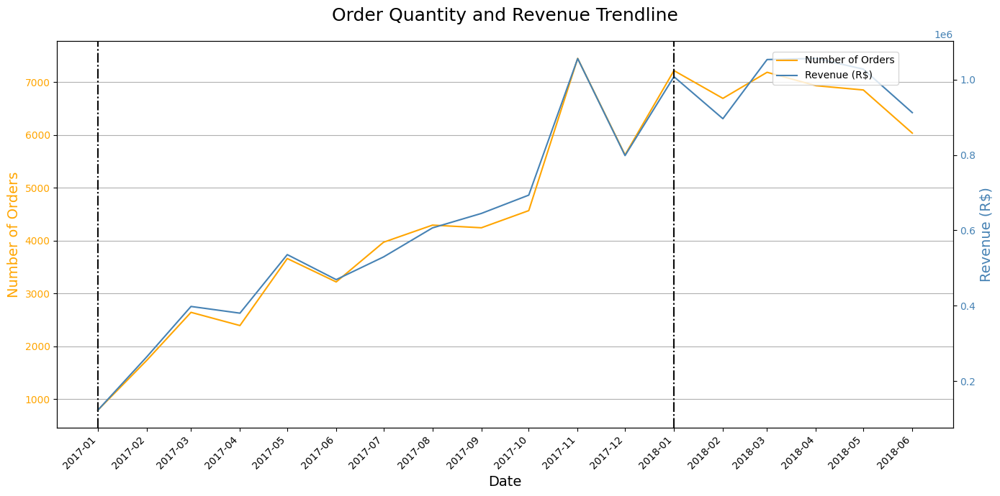
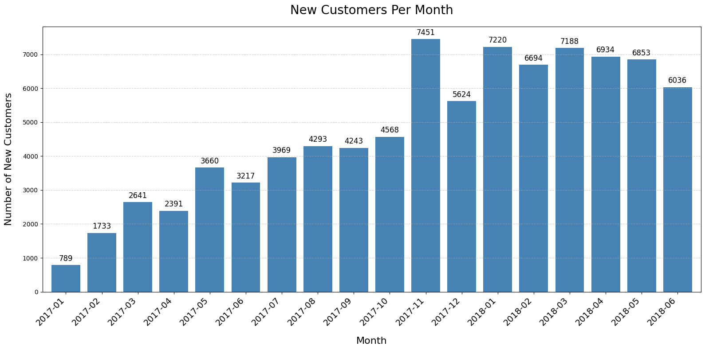
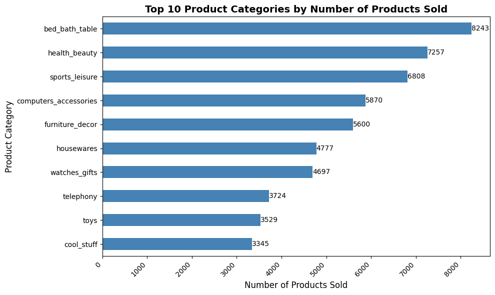
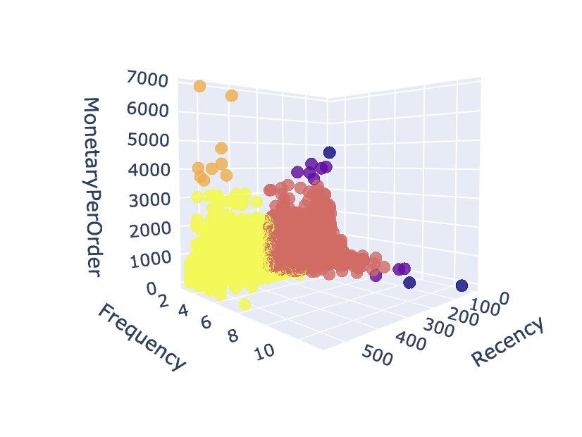
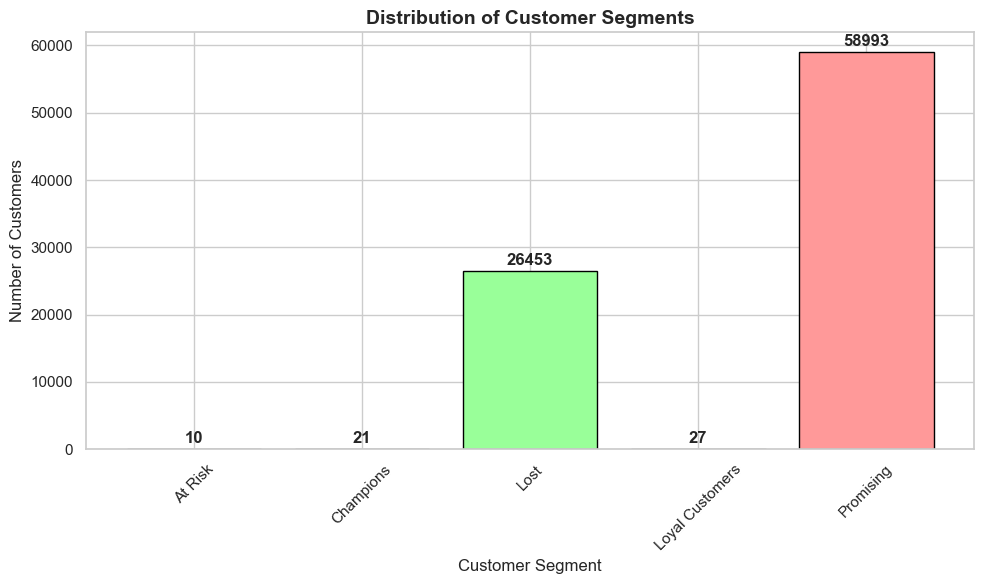
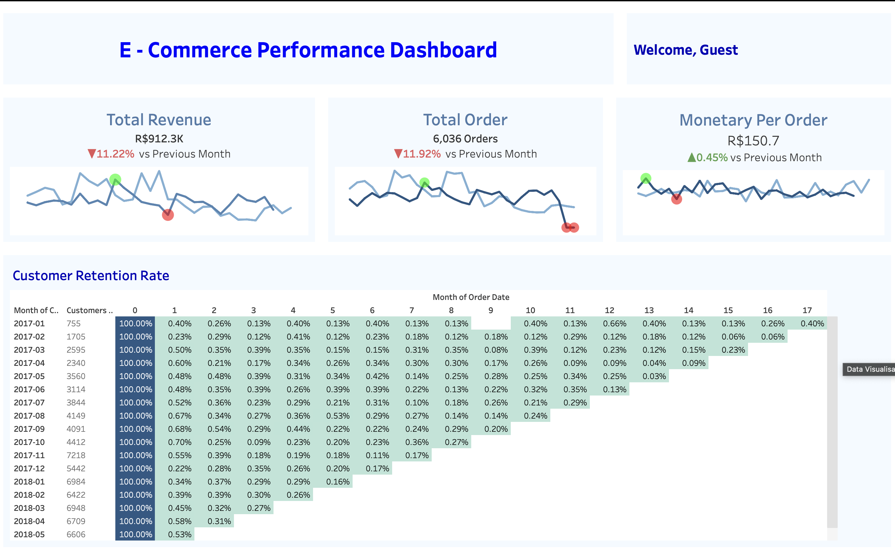
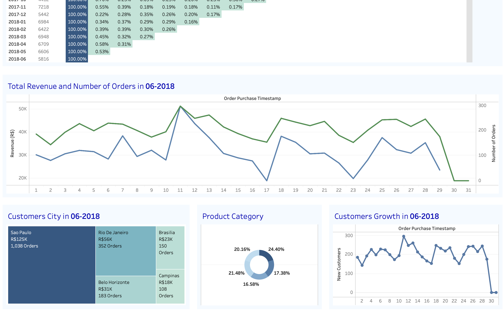

# **Olist E-Comnmerce Customer Segmentation**

### **Creator Profile** 
1. Ilham Taufieq Julfianto - taufieq17@gmail.com | [LinkedIn](https://www.linkedin.com/in/ilham-taufieq-julfianto/) | [GitHub](https://github.com/ilhamtaufieq17)
2. Irene Selena Mulyono - ireneselenam@gmail.com | [LinkedIn](https://www.linkedin.com/in/ireneselena/) | [GitHub](https://github.com/ireneselena)
3. Hamzah Mulyana - hamzahmulyana88@gmail.com | [LinkedIn](https://www.linkedin.com/in/hamzah-mulyana/) | [GitHub](https://github.com/hamzahmulyana)

### **Content**
1. Business Problem Understanding
2. Data Understanding
3. Exploratory Data Analysis
4. Modeling Experiment
5. Cluster Analysis
6. Recommendation System
7. Conclusion & Business Strategy Recommendation

Dataset source : (https://www.kaggle.com/datasets/olistbr/brazilian-ecommerce)

## **I. Business Problem Understanding**
#### **Context**
Olist is a Brazilian platform that helps small businesses sell on major marketplaces like Amazon and MercadoLibre. It simplifies listings, payments, logistics, and order management, allowing SMBs to reach more customers and compete with larger retailers while managing everything through a single platform.

**E-commerce Definition**

E-commerce, or electronic commerce, refers to the buying and selling of goods and services through the internet. It encompasses various business models, including online retail, marketplaces, business-to-business (B2B) commerce, and consumer-to-consumer (C2C) sales. E-commerce platforms provide customers with a convenient way to shop for products, compare prices, read reviews, and make payments through digital means. The rapid growth of e-commerce has been driven by technological advancements, shifting consumer behavior, and increased internet accessibility, leading businesses to focus on creating seamless and personalized online shopping experiences to meet customer needs.

#### **Problem Statement**

The e-commerce business is currently facing a significant challenge in retaining its customers. Despite efforts to attract new customers, the current customer retention rate is extremely low, sitting below 1%. This is far below the industry average, where the retention rate should be at least 25% to sustain growth and profitability. [Source](https://loyaltylion.com/blog/customer-retention-rate#:~:text=Other%20reports%20suggest%20ecommerce%20brands,problem%20with%20your%20customer%20retention.)

This low retention rate indicates that most customers do not return to make additional purchases after their initial interaction with the business. This problem not only impacts revenue but also increases the cost of acquiring new customers, which is substantially higher than retaining existing ones. The goal of this project is to identify key factors contributing to low customer retention and implement strategies to improve it.

#### **Goals**
Our goal for this project is to enhance customer retention by understanding customer behaviors and segmenting them effectively. By leveraging RFM (Recency, Frequency, Monetary) analysis, we aim to classify customers into distinct groups and develop tailored strategies to address their unique characteristics. The specific goals of this project are:

1. **Distinguish Customers into Segments Based on RFM:** Identify and classify customers into various segments based on their purchasing behavior using RFM analysis. This segmentation will help uncover patterns in customer interactions, enabling a more targeted approach to customer management.

2. **Identify Customer Characteristics for Each Segment:** Analyze the characteristics of each customer segment to understand their preferences and behaviors. This knowledge will be used to craft business strategies tailored to each segment's needs, with the ultimate goal of increasing customer retention rates and maximizing lifetime value.

The ultimate objective is to utilize these insights to create data-driven marketing and customer engagement strategies that will improve customer loyalty and foster long-term profitability.

#### **Analytical Approach**
1. **Proposed Solution**

- **Data Analytics for Pattern Exploration:** We will begin by using data analytics techniques to explore customer purchasing behaviors, identify patterns, and uncover trends that impact customer retention. This step will provide a deeper understanding of the data, setting the foundation for further analysis.

- **Clustering for Customer Segmentation:** Next, we will implement clustering algorithms to segment customers based on their RFM (Recency, Frequency, Monetary) characteristics. This segmentation will help us group customers into distinct categories, each with unique behaviors and preferences.

- **Identify Characteristics to Increase Retention:** By analyzing each customer segment, we will identify key characteristics that contribute to customer loyalty and retention. Understanding these characteristics will guide the creation of targeted strategies aimed at improving retention rates across various customer segments.

2. **Implementation and Usage**

This analysis and model can be implemented as part of the business's ongoing strategy review process. Specifically, it can be utilized during quarterly performance meetings to assess current customer segments and evaluate the effectiveness of retention strategies. By incorporating this analysis into regular business reviews, the company can make data-driven decisions, adjust marketing efforts, and address customer needs more effectively. This iterative use of clustering results will help the business continually adapt its strategies to foster long-term customer loyalty and increase overall retention rates.

#### **Assumptions & Project Limitation**
1. **Data Availability:** The model is built on historical e-commerce transaction data. However, customer behaviors and market trends can change over time due to factors like seasonality, economic conditions, and shifts in consumer preferences. The model may not fully capture these dynamic changes, which could impact the accuracy of future segmentations.

2. **Feature Limitations:** The clustering model primarily relies on RFM (Recency, Frequency, Monetary) features for segmentation. While RFM provides valuable insights into customer behaviors, it may not include other potentially influential factors, such as customer demographics, product preferences, or website interaction data. This limitation could result in an incomplete understanding of customer segments.

3. **Interpretability of Clusters:** Although interpretability is a key success criterion, some clusters might be less distinct or harder to interpret, especially if there is overlap between customer behaviors. This could limit the effectiveness of tailored marketing strategies if the characteristics of certain segments are not clearly understood.

## **II. Data Understanding**
#### **Data Cleaning and Clean Data**
After further data cleaning and handling anomalies, we have decided to go with these 24 columns: order_id, customer_id, order_status, order_purchase_timestamp, order_approved_at, order_delivered_customer_date, order_estimated_delivery_date, order_item_id, product_id, seller_id, price, freight_value, payment_sequential, payment_type, payment_installments, payment_value, customer_unique_id, customer_zip_code_prefix, customer_city, customer_state, review_score, seller_zip_code_prefix, seller_state, seller_city, product_category. These columns provide comprehensive details across customer demographics, purchase behavior, product preferences, and transaction specifics, making them ideal for understanding the diverse characteristics of our customer base. Given the low retention rate of around 0.3%, leveraging this rich dataset will allow us to identify key customer segments and develop more effective strategies to boost retention and long-term customer loyalty.

## **III. Exploratory Data Analysis**
#### **Number of Orders and Revenue Trend**

Based on the line chart depicting the "Order Quantity and Revenue Trendline" from January 2017 to June 2018, there is a consistent upward trend in both the number of orders and revenue, highlighting strong growth throughout 2017. A significant spike occurred in Q4 2017, likely due to seasonal factors such as holiday promotions, resulting in peak order volumes and revenue. After this peak, both metrics show a slight decline and stabilization starting in early 2018, indicating a potential cooling down after the seasonal high. The parallel movement of order quantity and revenue suggests a strong correlation between the two, although the slight disparity in late 2017 might imply the impact of discounts or promotions on profitability. This analysis emphasizes a positive overall growth trajectory but also suggests the need for strategies to maintain momentum and mitigate the post-peak decline.

#### **Monthly Customer Growth**

Based on the bar chart, we can see that there is a consistent increase in new customer acquisition throughout 2017, with notable peaks in November and December 2017, likely due to successful marketing efforts and seasonal campaigns. The highest point was observed in December 2017 with 7,451 new customers, highlighting a significant surge in interest during the holiday season. Following this peak, new customer growth experienced some fluctuations, eventually stabilizing in the first half of 2018. Despite these slight fluctuations, the overall trend remains positive, suggesting effective acquisition strategies; however, the declining trend after the peak may indicate the need to enhance engagement and sustain customer acquisition momentum beyond seasonal factors.

#### **Top Product Categories**

it is evident that the **bed_bath_table** category dominates sales with 8,243 units sold, followed closely by **health_beauty** and **sports_leisure** categories, which have 7,257 and 6,808 units sold, respectively. The popularity of these categories suggests a strong customer preference towards home essentials, personal care, and recreational activities. Categories such as **computers_accessories** and **furniture_decor** also exhibit significant sales, indicating a healthy demand for home and tech-related products. The lower-performing categories, like **cool_stuff** and **toys**, may represent niche markets or less targeted segments. Overall, the data provides valuable insights into customer preferences, which can inform inventory planning, marketing strategies, and targeted campaigns to boost sales in underperforming categories.

#### **Payment Method Proportion**

The pie chart shows that **credit cards** are the dominant payment method, accounting for **75.8%** of all transactions. The next most common method is **boleto** (a popular payment method in Brazil), representing **20.1%** of payments. **Debit cards**, **vouchers**, and other payment methods have a minor share, collectively making up a small portion of the overall payment landscape. This indicates that the majority of customers prefer using credit cards, suggesting a need to ensure seamless support for credit card payments while exploring ways to encourage adoption of alternative payment methods to cater to a broader customer base.

## **IV. Modeling Experiment**
#### **Chosen Experiment for this Clustering Project**
After experimenting with different clustering techniques, including machine learning methods (PCA + K-Means, DBSCAN) and manual approaches, we concluded that manual clustering provides clearer and more actionable segmentation for our customer base. Unlike machine learning-driven clusters that are often complex to interpret, manual clustering allows us to establish precise rules based on business logic, ensuring that segments are both understandable and aligned with our business objectives.

Rationale for Choosing Manual Clustering with Set Feature 2

Out of the various feature sets we explored, we selected Set Feature 2, which comprises Recency, Frequency, and Monetary Value per Order (as opposed to total Monetary Value). The primary reason for this choice is that Monetary Value per Order is more directly aligned with our objective of boosting customer retention. By analyzing the average value of individual purchases, we can better target customers making high-value transactions, regardless of their total spending over time.

Monetary Value per Order helps highlight customers who may not purchase frequently but spend significantly when they do. This makes them ideal candidates for retention initiatives, such as personalized offers or loyalty programs, aimed at encouraging repeat purchases.
Prioritizing Monetary Value per Order instead of overall Monetary Value allows us to focus on maximizing the value derived from each customer interaction, which is crucial for enhancing customer lifetime value and long-term retention.
Conclusion

Using manual clustering with Recency, Frequency, and Monetary Value per Order allows us to create actionable customer segments that directly support our retention strategies. This approach ensures our segmentation remains easy to interpret and is aligned with fostering more frequent and high-value transactions, ultimately improving our customer retention outcomes.

## **V. Cluster Analysis**
#### **Cluster Distribution**

The result of the clustering reveals that the majority of our customers fall into the **Promising** segment, with 58,993 customers, suggesting that these customers show potential for increased engagement if targeted effectively. A significant portion, **26,453 customers**, are categorized as **Lost**, indicating the need for strategies to re-engage or understand why these customers disengaged. There are only a handful of customers in the **Champions** (21), **Loyal Customers** (27), and **At Risk** (10) segments, which points to a substantial opportunity to nurture customer relationships to boost the number of loyal and high-value customers. The distribution suggests a focus on moving customers from the Promising category into more loyal segments to maximize long-term retention and customer lifetime value.

#### **Customer Segment Difference Summarized**

| **Customer Segment**  | **Order Quantity Trend**                                                                                   | **Revenue Trend (R$)**                     | **Monetary Value per Order (R$)**           | **Payment Method**                        | **Insights**                                                                                         |
|-----------------------|-------------------------------------------------------------------------------------------------------------|--------------------------------------------|--------------------------------------------|-------------------------------------------|------------------------------------------------------------------------------------------------------|
| **Champions**         | Low number of orders, peaking at 3.                                                                        | Peaks notably, especially in late 2017.    | R$54.03 - R$4,681.78                       | 100% Credit Card                          | High-value customers with irregular purchases; retention through loyalty and exclusive offers.      |
| **Loyal Customers**   | Fluctuating, rarely exceeding 1.5 orders per instance.                                                     | R$1,000 - R$3,000 during peak periods.     | R$87.11 - R$4,175.26                       | 74.07% Credit Card, 25.93% Boleto         | Customers are flexible in spending; focus on personalized strategies to increase frequency.         |
| **Potential Loyalist**| No customers fall into this cluster.                                                                       | Not Applicable                            | Not Applicable                            | Not Applicable                            | No data for this cluster.                                                                            |
| **Promising**         | Significant rise from late 2017, peaking at over 1200.                                                     | Reached over R$160,000 during peak.        | R$6.08 - R$3,297.4                         | 76.5% Credit Card, 19.5% Boleto, Others   | High growth potential; engagement strategies can convert to loyal customers.                        |
| **At Risk**           | Small order quantity, with minimal fluctuation.                                                            | Revenue from R$3,602.47 to R$6,929.31.     | R$3,602.47 - R$6,929.31                    | 90% Credit Card, 10% Boleto               | Customers with high value per order; retention critical to prevent major loss.                      |
| **Lost**              | Fluctuates; experienced peaks in mid-2017 and subsequent consistency.                                      | Consistent peaks in mid-2017.              | R$9.27 - R$3,048.27                        | 74.35% Credit Card, 21.47% Boleto, Others | Low engagement, but still revenue-generating; reactivate with personalized communication.           |

## **VI. Recommendation System**
#### **Customer Segment Different Product Category Preferences**
| Cluster | Top Product Categories                         | Business Strategies                                                                                                                                                                                                                          |
|---------|------------------------------------------------|----------------------------------------------------------------------------------------------------------------------------------------------------------------------------------------------------------------------------------------------|
| 1       | sports_leisure, bed_bath_table, furniture_decor, fashion_bags_accessories, computers | 1. **Targeted Promotions on Sports and Leisure Products**: Offer exclusive promotions, loyalty rewards, or bundled offers for popular sports and leisure products. 2. **Home Improvement Campaigns**: Promote bed and bath table, furniture, and decor to match customer preferences. 3. **Cross-Selling Opportunities**: Recommend fashion bags, accessories, and computers. 4. **Loyalty Programs and Exclusive Deals**: Engage high-value customers with personalized loyalty programs. |
| 2       | bed_bath_table, furniture_decor, housewares, cool_stuff, baby | 1. **Focus on Home Essentials and Decor**: Design promotions focused on home improvement. 2. **Leverage Loyalty with Exclusive Home Product Offers**: Offer discounts on home-related products. 3. **Cross-Promote Unique and Family-Oriented Products**: Pair cool_stuff and baby products with home essentials. 4. **Loyalty-Driven Campaigns**: Create tailored promotions to boost loyalty.  |
| 4       | bed_bath_table, health_beauty, sports_leisure, computers_accessories, watches_gifts | 1. **Home Comfort and Wellness Promotions**: Promote bed, bath, and beauty categories. 2. **Fitness and Leisure Marketing**: Offer promotions and bundles on sports products. 3. **Tech and Personal Accessory Cross-Selling**: Suggest pairing computers and accessories. 4. **Personalized Loyalty and Upselling Opportunities**: Focus on loyalty and upselling for tech products. |
| 5       | small_appliances, art, computers, computers_accessories, housewares | 1. **Focused Campaign for Small Appliances**: Highlight convenience and re-engagement for small appliances. 2. **Diverse Product Marketing**: Create cross-category promotions with computers, accessories, and housewares. 3. **Reactivation Strategies**: Offer discounts on small appliances. 4. **Personalized Recommendations**: Tailored suggestions for previous purchases. 5. **Retention Initiatives**: Focus on reducing churn with loyalty programs for small appliances. |
| 6       | bed_bath_table, sports_leisure, health_beauty, furniture_decor, housewares | 1. **Home Essentials and Comfort Campaigns**: Focus on home comfort products. 2. **Leisure and Fitness Marketing**: Bundle sports and fitness items. 3. **Health and Wellness Campaigns**: Highlight self-care benefits. 4. **Reactivation Strategies**: Offer limited-time discounts on home decor. 5. **Targeted Retention Initiatives**: Provide loyalty rewards for home-related products.  |

## **VII. Conclusion & Business Strategy Recommendation**
#### **Conclusion**

- The company faces a **low customer retention rate** (<1%) compared to the industry average (25%). This gap represents lost revenue, emphasizing the need for improved retention strategies.
- **Manual Clustering using Set Feature 2** was selected due to its interpretability, leading to **5 distinct customer segments**:

  1. **Champions (Cluster 1):** High-value, recent, and frequent buyers. They represent the core revenue source and should be prioritized with loyalty rewards and personalized promotions.
  2. **Loyal Customers (Cluster 2):** Consistent purchasers but with slightly lower recency than Champions. Strategies should focus on re-engaging them more frequently and offering upsell opportunities.
  3. **Promising (Cluster 4):** Moderately recent buyers showing interest but with lower frequency. Targeted promotions and engagement campaigns can convert them into higher-value customers.
  4. **At Risk (Cluster 5):** Previously high-value customers with reduced engagement. Reactivation campaigns and personalized retention offers are crucial to prevent further churn.
  5. **Lost (Cluster 6):** Disengaged customers with very low recency and frequency. Win-back campaigns with deep discounts or incentives could potentially re-engage them.

#### **Business Strategy Recommendations**

- **Cluster 1 (Champions):** Leverage their interest in **sports and home goods** with loyalty rewards, exclusive discounts, and personalized cross-selling. Continue nurturing them with loyalty programs.
  
- **Cluster 2 (Loyal Customers):** Increase engagement through campaigns focused on **home goods**. Provide flexible payment options and upsell premium products to move them toward the Champions cluster.

- **Cluster 4 (Promising):** Convert potential into frequent buyers by offering discounts on **bed, bath, and beauty** products. Incentivize them to switch to **credit card** payments and encourage cross-category purchases.

- **Cluster 5 (At Risk):** Focus on personalized retention efforts, exclusive deals on **high-ticket items** like **small appliances** and **computers**. Encourage installment plans to ease payment and drive higher-value transactions.

- **Cluster 6 (Lost):** Implement win-back strategies, including personalized offers in **bed, bath, and sports categories**, and provide discounts or promotions to re-engage them. Launch seasonal campaigns to entice them back.

## **Tableau Dashboard**
[Tableau Dashboard](https://public.tableau.com/shared/H794555WY?:display_count=n&:origin=viz_share_link)

We have also made an interactive Tableau dasboard regarding Olist Performance dasboard where users can filter it by its customer segment to gain insights regarding each customer segment.

